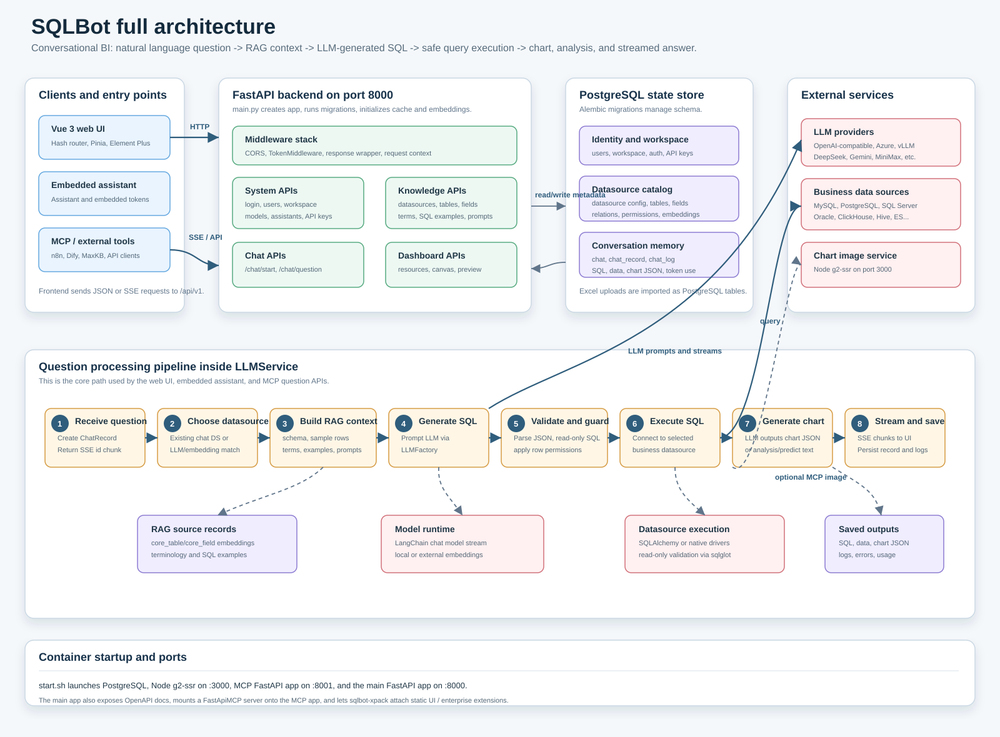

# SQLBot Architecture

This repository is a conversational BI system. A user asks a natural-language question, SQLBot builds database context with RAG, asks an LLM to produce safe SQL, executes that SQL against the selected datasource, then returns data, chart configuration, analysis, and logs.

Open the SVG diagram here:

## Runtime Shape

- `frontend/` is a Vue 3 SPA. It uses hash routing, Pinia state, Element Plus UI, Axios for normal API calls, and `fetch` for streamed chat responses.
- `backend/` is a FastAPI application. `main.py` wires middleware, routers, OpenAPI docs, startup migration/cache/embedding work, and MCP integration.
- PostgreSQL is the application metadata store: users, workspaces, model settings, datasource catalog, table/field metadata, embeddings, chats, records, logs, dashboards, terminology, and training examples.
- External business databases are queried only after SQL is generated and validated. Supported connectors include MySQL, PostgreSQL, SQL Server, Oracle, ClickHouse, SQLite, Doris, StarRocks, DM, Redshift, Kingbase, Hive, Elasticsearch, and Excel-imported tables.
- `g2-ssr/` is a small Node service used to render chart PNGs for MCP or external responses.
- `sqlbot-xpack` is an extension package loaded by the backend for enterprise/static UI/extension behavior.

## Main Request Flow

1. The web UI calls `/api/v1/chat/start`, then streams `/api/v1/chat/question`.
2. `TokenMiddleware` authenticates browser, assistant, embedded, or API-key style requests.
3. `apps.chat.api.chat` creates or loads a chat record and delegates the real work to `LLMService`.
4. `LLMService` selects a datasource if the chat does not already have one.
5. It retrieves schema, sample rows, table embeddings, terminology, SQL examples, and custom prompts.
6. It asks the configured LLM to produce a JSON answer containing SQL and suggested chart type.
7. SQL is parsed, saved, checked as read-only, and optionally rewritten with row permissions.
8. SQL is executed through the datasource connector layer.
9. Query data is saved to the chat record, then a second LLM call produces chart JSON.
10. The backend streams incremental SSE chunks back to the frontend and persists chat logs/token usage.

## Important Files

- `backend/main.py` - backend startup, middleware, router registration, OpenAPI, MCP setup.
- `backend/apps/api.py` - aggregate router for all backend modules.
- `backend/apps/chat/api/chat.py` - chat HTTP endpoints and streaming responses.
- `backend/apps/chat/task/llm.py` - main orchestration pipeline for datasource selection, RAG, SQL generation, SQL execution, charting, analysis, prediction, and recommendations.
- `backend/apps/ai_model/model_factory.py` - LangChain model factory for OpenAI-compatible, Azure, and vLLM-style providers.
- `backend/apps/db/db.py` - datasource connection, SQL execution, result formatting, and read-only SQL validation.
- `backend/apps/datasource/crud/datasource.py` - datasource lifecycle, schema sync, table/field metadata, samples, and permissions-aware previews.
- `backend/apps/datasource/embedding/table_embedding.py` - table embedding selection for question-to-schema RAG.
- `frontend/src/utils/request.ts` - frontend API client, auth headers, assistant headers, and streaming fetch.
- `frontend/src/api/chat.ts` - frontend chat API methods and chat record models.
- `frontend/src/router/index.ts` - main UI routes.
- `g2-ssr/app.js` - chart image renderer.
- `start.sh` - container startup process.
